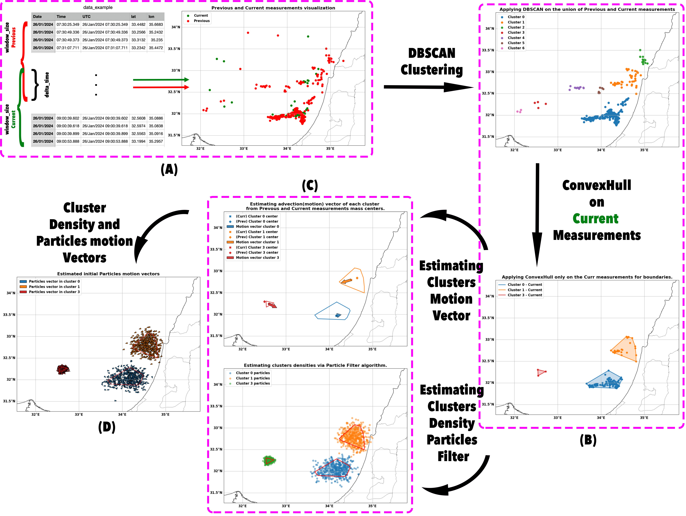

# Real-Time Probabilistic Nowcasting of Lightning Density via a Sequential Monte Carlo Framework

This repository contains the implementation of a **Sequential Monte Carlo (Particle Filter)** framework for probabilistic lightning density nowcasting, as described in the paper *"Real-Time Probabilistic Nowcasting of Lightning Density via a Sequential Monte Carlo Framework"* by Vlad Landa et al., submitted to *Weather and Forecasting*.

The pipeline ingests raw lightning strike observations from regional detection networks (ILDN/ENTLN), clusters active cells with DBSCAN, estimates storm motion vectors, and propagates particle-based density fields forward in time to produce calibrated probability maps at lead times of 1–6 hours.

---

## 🔬 Algorithm Overview

The two figures below illustrate the full nowcasting pipeline.

**Part 1 — Setup: clustering, motion estimation, and particle initialisation**



**Part 2 — Nowcast: particle propagation, density estimation, and evaluation**


---

## 📦 Requirements

```bash
pip install numpy pandas scikit-learn matplotlib cartopy PyQt5 superqt opencv-python tqdm openpyxl
```

---

## 🖥️ Interactive Application — `applicationV2.py`

`applicationV2.py` is a **PyQt5 desktop GUI** for interactive real-time nowcasting. It loads a lightning detection file, runs the particle filter tracker, and displays live density estimates and predictions on a geographic map.

### Launch

```bash
python applicationV2.py
```

The application opens a file dialog on startup. Select any `.xlsx` or `.csv` lightning file with columns `UTC`, `lat`, `lon`.

### GUI Controls

| Control | Description |
|---------|-------------|
| **File** menu | Load a new lightning detection file |
| **History window** | Duration of past observations used to initialise the tracker (minutes) |
| **dt** | Time step between the previous and current observation windows (minutes) |
| **N particles** | Number of particles per cluster (default: 200) |
| **Min samples** | DBSCAN minimum samples parameter for cluster formation |
| **Max dist** | DBSCAN maximum distance (degrees) for neighbourhood search |
| **Contour resolution** | Grid resolution for the KDE density map (X × Y cells) |
| **Step slider** | Number of prediction steps to propagate forward |
| **Threshold slider** | Probability threshold for the density contour display |
| **Checkboxes** | Toggle particles, KDE contour, scatter plots, velocity arrows |
| **Simulate** button | Run one prediction step forward |
| **Reset** button | Re-initialise the tracker from the current frame |

### Settings persistence

All GUI parameters are automatically saved to `settings.pk` in the working directory and reloaded on the next launch.

### Key configuration (inside `Settings` class)

```python
nswe             = {'w': 31.0, 'e': 37.0, 's': 29.0, 'n': 35.0}  # ROI bounding box
history_window   = timedelta(minutes=60)   # look-back window
dt               = timedelta(minutes=30)   # time step
min_samples      = 3                       # DBSCAN min samples
max_dist         = 0.2                     # DBSCAN epsilon (degrees)
contour_resolution_x = 100                # KDE grid width
contour_resolution_y = 100                # KDE grid height
```

---

## 📊 Batch Evaluation — `evaluationV2.py`

`evaluationV2.py` runs a **systematic parameter sweep** over the full particle filter configuration space, computing skill scores (AUC-ROC, AUC-PR, FSS, CSI) across all combinations of history windows, time steps, DBSCAN parameters, and grid resolutions.

### Usage

```bash
python evaluationV2.py -f "ILDN 2023-2024 season.xlsx"
```

Optionally provide a separate ground truth file:

```bash
python evaluationV2.py -f "ILDN 2023-2024 season.xlsx" -gt "GT_reference.xlsx"
```

### Arguments

| Argument | Short | Required | Description |
|----------|-------|----------|-------------|
| `--file` | `-f` | ✅ Yes | Path to the lightning detection `.xlsx` file to evaluate |
| `--gound_truth` | `-gt` | No | Path to a separate ground truth `.xlsx` file (if different from input) |

### Parameter sweep (configured inside the script)

```python
history_windows  = [15, 30, 45, 60, 75, 90]   # minutes
dts              = [15, 30, 45, 60]            # minutes
min_samples      = [3]
max_dists        = [0.2, 0.3]                  # degrees
grid_sizes_km    = [10, 5, 2]                  # km
steps            = [1, 2, 3, 4, 5, 6]         # lead time steps (hours)
```

This produces **144 parameter combinations × 172,800 total simulations**. Results are cached to `results/<filename>_results.pk` so the sweep does not need to be re-run if the file already exists.

### Outputs

Results are saved under the `results/` directory:

| File | Description |
|------|-------------|
| `<filename>_results.pk` | Pickled dictionary of all simulation outputs indexed by parameter tuple |
| Skill score tables | Printed to stdout; can be redirected to a file |

---

---

# Lightning Nowcasting: XGBoost Baseline

This repository contains the baseline classical machine learning pipeline for short-term lightning forecasting (nowcasting). It uses **XGBoost** trained on gridded historical lightning strike data to predict the probability of future lightning occurrences at various lead times (1 to 6 hours).

**Note on Methodology:** This is a tree-based ensemble approach, serving as a classical Machine Learning baseline to be compared against more complex Deep Learning (e.g., CNN, ConvLSTM) spatial-temporal models.

## 🧠 Methodology & Feature Engineering

The pipeline converts raw, sparse lightning strike data into dense spatio-temporal cubes (default 5-minute bins). Because XGBoost cannot natively process spatial or sequential data, the script engineers explicit tabular features for each grid cell:

* **Temporal History:** Strike counts aggregated over configurable rolling windows (e.g., 10, 20, 40, 120 minutes).
* **Spatial Context:** Neighbourhood sums (radius 1 and 2) of recent strikes to detect incoming/expanding storms.
* **Decay Mechanics:** An exponentially decaying sum of past strikes to capture storm dissipation.
* **Cyclic Time:** Sine/Cosine encodings of the hour of the day and month of the year to capture diurnal and seasonal climatology.
* **Static Spatial Proxies:** Normalized latitude, longitude, distance to the coast, a binary land/sea mask, and a linear-regression proxy for topography.
* **Calibration:** The model applies Isotonic Calibration post-training using a temporal holdout set to ensure predicted probabilities match empirical observation frequencies.

## 📦 Requirements

`pip install numpy pandas xgboost scikit-learn openpyxl pyarrow`

## 📂 Data Format

The input data must be provided as Excel files (`.xlsx`). Both training and testing files must contain the following columns:

* `UTC`: A parseable datetime string/object.
* `lat`: Latitude of the strike (float).
* `lon`: Longitude of the strike (float).

**Data Constraints enforced by the pipeline:**
1. **Strict Temporal Separation:** The script will halt if the maximum date in the training set overlaps with the minimum date in the testing set.
2. **Wet Season Only:** Data is automatically filtered to keep only the active lightning season (October – April) to prevent zero-inflation from summer months.
3. **ROI Filtering:** Data is strictly filtered to a hardcoded bounding box: `w: 31.0, e: 37.0, s: 29.0, n: 35.0` (Eastern Mediterranean).

## 🚀 Usage

### Option 1: Automated Bash Script (Recommended)
The repository includes an orchestration script that handles file paths, hyperparameter configuration, and sequential execution of training and plotting.

`bash run_baseline_xgboost.sh`

Override parameters (e.g., lower the negative downsampling ratio):

`bash run_baseline_xgboost.sh --neg_ratio 0.05`

### Option 2: Manual Python Execution
You can run the Python script directly for finer control over specific lead times or grid sizes.

`python xgboostalgo.py --train "ENTLN 2022-2023 season.xlsx" --test "ENTLN 2023-2024 season.xlsx" --grid 0.16 --windows 10 20 40 120 240 360 --leadtimes 60 120 180 240 300 360 --depth 12 --trees 700 --lr 0.01 --neg_ratio 0.15 --output baseline_results_entln`

## 📊 Outputs

Results are saved in the directory specified by `--output`. The pipeline generates a separate directory for each targeted lead time (e.g., `60min/`, `120min/`).

Inside each lead time directory, you will find:
* `predictions.parquet`: A dataframe containing the test set `time`, `iy`, `ix`, `y_true`, and `y_prob`.
* `metrics.json`: Threshold-independent (AUC-ROC, AUC-PR, Brier) and threshold-optimal (Precision, Recall, F1) metrics.
* `model.json`: The raw serialized XGBoost model.
* `feature_importance.json`: Gain-based feature importance extracted from the trees.

A global `summary_metrics.json` is generated at the root of the output directory comparing performance across all lead times.

## ⚠️ Critical Limitations & Assumptions

When evaluating this baseline against other models, note the following built-in assumptions:

1. **Topographic Oversimplification:** The "elevation" feature is a linear proxy derived mathematically from coordinates (`-400 × (lat - 31.5) + 600 × (lon - 34.8)`). It is not a true Digital Elevation Model (DEM). This assumes storm behavior scales linearly with coordinate gradients, which ignores complex local orography.
2. **Geographic Hardcoding:** The script contains hardcoded coordinates for Israel/Lebanon coastlines and bounding boxes. It will require code refactoring to apply to other global regions.
3. **Loss of Spatial Topology:** Flattening grids into tabular features (even with `neighborhood_sum`) is inherently lossy. The model cannot learn complex spatial advection patterns (e.g., storm cell rotation, frontal boundaries) the way a Deep Learning vision model would.
4. **Temporal Independence Assumption:** XGBoost treats every timestep and grid cell as an independent IID observation. While the script implements a `gap_threshold_minutes` to prevent feature leakage across calendar gaps, it cannot learn continuous temporal dependencies (like an LSTM).
